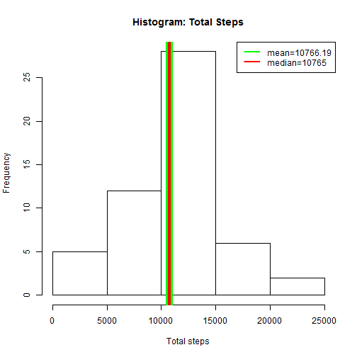
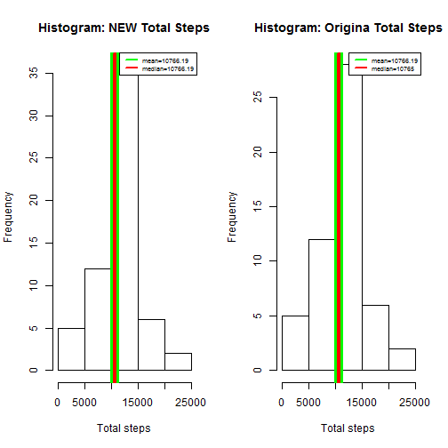

###**Loading and Preprocessing the data**

```r
data <- read.csv('activity.csv')
data <- na.omit(data)
data$date <- as.Date(data$date)
head(data)
```

```
##     steps       date interval
## 289     0 2012-10-02        0
## 290     0 2012-10-02        5
## 291     0 2012-10-02       10
## 292     0 2012-10-02       15
## 293     0 2012-10-02       20
## 294     0 2012-10-02       25
```


###**What is the mean total number of steps taken per day? 10766.19 steps**


```r
library(dplyr)
```

####1.) Total Steps per day.

```r
gbDate <- group_by(data, date)
totalSteps <- summarise(gbDate, total_steps=sum(steps))
as.data.frame(totalSteps)
```

```
##          date total_steps
## 1  2012-10-02         126
## 2  2012-10-03       11352
## 3  2012-10-04       12116
## 4  2012-10-05       13294
## 5  2012-10-06       15420
## 6  2012-10-07       11015
## 7  2012-10-09       12811
## 8  2012-10-10        9900
## 9  2012-10-11       10304
## 10 2012-10-12       17382
## 11 2012-10-13       12426
## 12 2012-10-14       15098
## 13 2012-10-15       10139
## 14 2012-10-16       15084
## 15 2012-10-17       13452
## 16 2012-10-18       10056
## 17 2012-10-19       11829
## 18 2012-10-20       10395
## 19 2012-10-21        8821
## 20 2012-10-22       13460
## 21 2012-10-23        8918
## 22 2012-10-24        8355
## 23 2012-10-25        2492
## 24 2012-10-26        6778
## 25 2012-10-27       10119
## 26 2012-10-28       11458
## 27 2012-10-29        5018
## 28 2012-10-30        9819
## 29 2012-10-31       15414
## 30 2012-11-02       10600
## 31 2012-11-03       10571
## 32 2012-11-05       10439
## 33 2012-11-06        8334
## 34 2012-11-07       12883
## 35 2012-11-08        3219
## 36 2012-11-11       12608
## 37 2012-11-12       10765
## 38 2012-11-13        7336
## 39 2012-11-15          41
## 40 2012-11-16        5441
## 41 2012-11-17       14339
## 42 2012-11-18       15110
## 43 2012-11-19        8841
## 44 2012-11-20        4472
## 45 2012-11-21       12787
## 46 2012-11-22       20427
## 47 2012-11-23       21194
## 48 2012-11-24       14478
## 49 2012-11-25       11834
## 50 2012-11-26       11162
## 51 2012-11-27       13646
## 52 2012-11-28       10183
## 53 2012-11-29        7047
```

####2.) Histogram of total steps taken each day.

```r
hist(totalSteps$total_steps, xlab = "Total steps", main ="Histogram: Total Steps")
abline(v = mean(totalSteps$total_steps), col = "green", lwd = 10)
abline(v = median(totalSteps$total_steps), col = "red", lwd = 4)
legend("topright", c("mean=10766.19", "median=10765"), col=c("green", "red"), lty =c(1,1), lwd=2)
```

 


####3.) Mean and median of total steps taken per day.

```r
##mean
mean(totalSteps$total_steps)
```

```
## [1] 10766.19
```

```r
##median
median(totalSteps$total_steps)
```

```
## [1] 10765
```


###**What is the average daily activity pattern?**

####1.) Time series plot using ggplot2

```r
library(ggplot2)
```

```
## Warning: package 'ggplot2' was built under R version 3.2.2
```

```r
gbInterval <- group_by(data, interval)
totalStepsInterval <- summarize(gbInterval, average_steps = mean(steps))

intervalMaxSteps <- filter(totalStepsInterval, average_steps == max(totalStepsInterval$average_steps))$interval
maxSteps <- filter(totalStepsInterval, average_steps == max(totalStepsInterval$average_steps))$average_steps

ggplot(totalStepsInterval, aes(interval, average_steps)) + geom_line() + geom_vline(xintercept=intervalMaxSteps, color="blue") + annotate("text", x = 1230, y = 206.1698, label = "V line = 5 Min interval MAX steps", color = "blue", size = 3) + ylab("Average Steps") + xlab("Time Intervals") + labs(title ="Time Series Plot(ggplot2)")
```

 

####2.) The 835 interval contains the maximum number of steps(206.1698113).


```r
##Interval containing maximum number of steps
intervalMaxSteps <- filter(totalStepsInterval, average_steps == max(totalStepsInterval$average_steps))$interval
intervalMaxSteps
```

```
## [1] 835
```

```r
##Max number of steps
maxSteps <- filter(totalStepsInterval, average_steps == max(totalStepsInterval$average_steps))$average_steps
maxSteps
```

```
## [1] 206.1698
```

###**Imputing missing values
####1.) Calculating & reporting total number of missing values in the dataset.

```r
dataNA <- read.csv("activity.csv")
summary(dataNA)
```

```
##      steps                date          interval     
##  Min.   :  0.00   2012-10-01:  288   Min.   :   0.0  
##  1st Qu.:  0.00   2012-10-02:  288   1st Qu.: 588.8  
##  Median :  0.00   2012-10-03:  288   Median :1177.5  
##  Mean   : 37.38   2012-10-04:  288   Mean   :1177.5  
##  3rd Qu.: 12.00   2012-10-05:  288   3rd Qu.:1766.2  
##  Max.   :806.00   2012-10-06:  288   Max.   :2355.0  
##  NA's   :2304     (Other)   :15840
```

```r
## there are total of 2304 NA's
```

####2.) I will be defining mean of steps for each 5-minutes interval of each day. For missing values, I will be replacing
####each value with the mean of steps of that specific 5-minutes interval.


####3.) New dataset with all NA replaced


```r
# Setting up data: 1.) reading 2.) changing na to x 3.) arranging data by date
testOriginal <- read.csv('activity.csv')
testOriginal$date <- as.Date(testOriginal$date)
testOriginal[is.na(testOriginal)] <- "x"
testOriginal <- arrange(testOriginal, date)

# Splitting DF into 2 DFs. noNA only contains data without NA
noNA <- filter(testOriginal, steps != "x")
noNA$steps <- as.numeric(noNA$steps)
# allNA contains only NA
allNA <- filter(testOriginal, steps == "x")

# Getting mean of steps in each unique interval
meanInterval <- summarize(group_by(noNA, interval), average_steps=mean(steps))

# Combining average steps with allNA DF
newCol <- cbind(meanInterval$average_steps, allNA)

# cleaning revised allNA 
newCol <- select(newCol, -steps)
colnames(newCol)[1] <- "steps"

# combining the 2 DF that was split making new DF with 
newDF <- arrange(rbind(newCol, noNA), date)
```


```r
print(newDF[1:10,])
```

```
##        steps       date interval
## 1  1.7169811 2012-10-01        0
## 2  0.3396226 2012-10-01        5
## 3  0.1320755 2012-10-01       10
## 4  0.1509434 2012-10-01       15
## 5  0.0754717 2012-10-01       20
## 6  2.0943396 2012-10-01       25
## 7  0.5283019 2012-10-01       30
## 8  0.8679245 2012-10-01       35
## 9  0.0000000 2012-10-01       40
## 10 1.4716981 2012-10-01       45
```

```r
summary(newDF)
```

```
##      steps             date               interval     
##  Min.   :  0.00   Min.   :2012-10-01   Min.   :   0.0  
##  1st Qu.:  0.00   1st Qu.:2012-10-16   1st Qu.: 588.8  
##  Median :  0.00   Median :2012-10-31   Median :1177.5  
##  Mean   : 37.38   Mean   :2012-10-31   Mean   :1177.5  
##  3rd Qu.: 27.00   3rd Qu.:2012-11-15   3rd Qu.:1766.2  
##  Max.   :806.00   Max.   :2012-11-30   Max.   :2355.0
```

####4.) Histogram of total # of steps. Mean & Median of total steps taken per day. 
* Yes, value is the same for Mean
* No, median is now 10766.19 instead of 10765.
* There are little to no impact after imputing missing data


```r
NDtotalSteps <- summarize(group_by(newDF, date), total_steps = sum(steps))
as.data.frame(NDtotalSteps)
```

```
##          date total_steps
## 1  2012-10-01    10766.19
## 2  2012-10-02      126.00
## 3  2012-10-03    11352.00
## 4  2012-10-04    12116.00
## 5  2012-10-05    13294.00
## 6  2012-10-06    15420.00
## 7  2012-10-07    11015.00
## 8  2012-10-08    10766.19
## 9  2012-10-09    12811.00
## 10 2012-10-10     9900.00
## 11 2012-10-11    10304.00
## 12 2012-10-12    17382.00
## 13 2012-10-13    12426.00
## 14 2012-10-14    15098.00
## 15 2012-10-15    10139.00
## 16 2012-10-16    15084.00
## 17 2012-10-17    13452.00
## 18 2012-10-18    10056.00
## 19 2012-10-19    11829.00
## 20 2012-10-20    10395.00
## 21 2012-10-21     8821.00
## 22 2012-10-22    13460.00
## 23 2012-10-23     8918.00
## 24 2012-10-24     8355.00
## 25 2012-10-25     2492.00
## 26 2012-10-26     6778.00
## 27 2012-10-27    10119.00
## 28 2012-10-28    11458.00
## 29 2012-10-29     5018.00
## 30 2012-10-30     9819.00
## 31 2012-10-31    15414.00
## 32 2012-11-01    10766.19
## 33 2012-11-02    10600.00
## 34 2012-11-03    10571.00
## 35 2012-11-04    10766.19
## 36 2012-11-05    10439.00
## 37 2012-11-06     8334.00
## 38 2012-11-07    12883.00
## 39 2012-11-08     3219.00
## 40 2012-11-09    10766.19
## 41 2012-11-10    10766.19
## 42 2012-11-11    12608.00
## 43 2012-11-12    10765.00
## 44 2012-11-13     7336.00
## 45 2012-11-14    10766.19
## 46 2012-11-15       41.00
## 47 2012-11-16     5441.00
## 48 2012-11-17    14339.00
## 49 2012-11-18    15110.00
## 50 2012-11-19     8841.00
## 51 2012-11-20     4472.00
## 52 2012-11-21    12787.00
## 53 2012-11-22    20427.00
## 54 2012-11-23    21194.00
## 55 2012-11-24    14478.00
## 56 2012-11-25    11834.00
## 57 2012-11-26    11162.00
## 58 2012-11-27    13646.00
## 59 2012-11-28    10183.00
## 60 2012-11-29     7047.00
## 61 2012-11-30    10766.19
```

```r
par(mfcol = c(1,2))

# new hist
hist(NDtotalSteps$total_steps, xlab = "Total steps", main ="Histogram: NEW Total Steps")
abline(v = mean(NDtotalSteps$total_steps), col = "green", lwd = 10)
abline(v = median(NDtotalSteps$total_steps), col = "red", lwd = 4)
legend("topright", c("mean=10766.19", "median=10766.19"), col=c("green", "red"), lty =c(1,1), lwd=2, cex=.6)

# Original hist
hist(totalSteps$total_steps, xlab = "Total steps", main ="Histogram: Origina Total Steps")
abline(v = mean(totalSteps$total_steps), col = "green", lwd = 10)
abline(v = median(totalSteps$total_steps), col = "red", lwd = 4)
legend("topright", c("mean=10766.19", "median=10765"), col=c("green", "red"), lty =c(1,1), lwd=2, cex = .60)
```

 

```r
# Mean of total steps.
mean(NDtotalSteps$total_steps)
```

```
## [1] 10766.19
```

```r
# Median of total steps.
median(NDtotalSteps$total_steps)
```

```
## [1] 10766.19
```


```r
length(NDtotalSteps$total_steps)
```

```
## [1] 61
```

```r
length(totalSteps$total_steps)
```

```
## [1] 53
```


###Are there differences in activity patterns between weekdays and weekends? YES


```r
## Adding day to newDF
addDay <- data.frame(steps=newDF$steps, date=newDF$date, day=weekdays(newDF$date), interval=newDF$interval)
addDay$day <- as.character(addDay$day)
weekday <- c("Monday","Tuesday","Wednesday","Thursday","Friday")
weekend <- c("Saturday", "Sunday")

onlyWeekend <- filter(addDay, day == "Sunday" | day == "Saturday")
onlyWeekday <- filter(addDay, day == "Monday" | day == "Tuesday" | day == "Wednesday" | day =="Thursday"|day =="Friday")

averageStepsWeekend <- summarize(group_by(onlyWeekend, interval), average_steps=mean(steps))
averageStepsWeekend$Day <- "Weekend"

averageStepsWeekday <- summarize(group_by(onlyWeekday, interval), average_steps=mean(steps))
averageStepsWeekday$Day <- "Weekday"

averageDay <- rbind(averageStepsWeekend, averageStepsWeekday)

library(lattice)

xyplot(average_steps~interval|Day, data = averageDay, layout=c(1,2), type="l", ylab="Number of steps", xlab="Interval")
```

 
